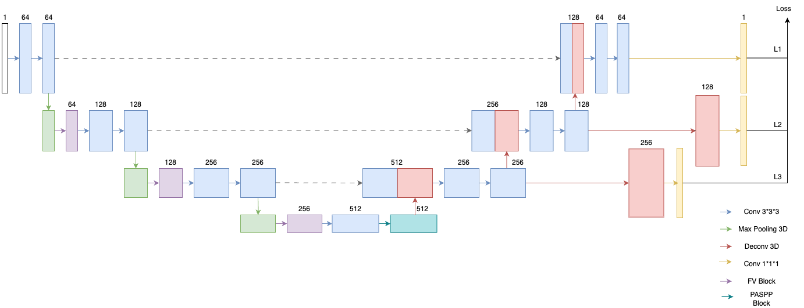

# Artificial Intelligence on Medical Imaging
Deep Learning approach on Medical Image

Lab 1: Pneumonia Classification
- Pneumonia classification using ResNet
- Report: ["LAB1.pdf"]([https://github.com/xup6YJ/Medical-AI/blob/main/LAB1/LAB1.pdf])

Lab 2: EEGNet
- EEG data classification 
- Implementation of 'EEGNet: a compact convolutional neural network for EEG-based brain–computer interfaces'
- Original paper: https://iopscience.iop.org/article/10.1088/1741-2552/aace8c
- Report: ["LAB2.pdf"]([https://github.com/xup6YJ/Medical-AI/blob/main/LAB2/LAB2.pdf])
  
Lab 3: COVID19 infection region segmentation
- Implementation of 'COVID-SegNet'
- Original paper: https://ieeexplore.ieee.org/abstract/document/9345435
- Report: ["LAB3.pdf"]([https://github.com/xup6YJ/Medical-AI/blob/main/LAB3/LAB3.pdf])

  

BRAVE-NET segmentation model ["BraveNet.ipynb"](https://github.com/xup6YJ/Medical-Image-Analysis/blob/main/Model_arch/BraveNet.ipynb) in Pytorch vision.
- Implementation of 'BRAVE-NET: Fully Automated Arterial Brain Vessel Segmentation in Patients With Cerebrovascular Disease'
- Original paper: https://doi.org/10.3389/frai.2020.552258

